# SQL简述
SQL是Structured Quevy Language的缩写，最初是由美国计算机科学家[Donald D. Chamberlin](https://en.wikipedia.org/wiki/Donald_D._Chamberlin#/media/File:Don_Chamberlin.jpg)和Raymond F. Boyce在20世纪70年代早期从 [Early History of SQL](https://ieeexplore.ieee.org/stamp/stamp.jsp?tp=&arnumber=6359709) 中了解关系模型后在IBM开发的。该版本最初称为[SEQUEL: A Structured English Query Language]（结构化英语查询语言），旨在操纵和检索存储在IBM原始准关系数据库管理系统System R中的数据。SEQUEL后来改为SQL，因为“SEQUEL”是英国Hawker Siddeley飞机公司的商标。我们看看这款用于特技飞行的英国皇家空军豪客Siddeley Hawk T.1A (Looks great):


## 第一款SQL数据库
在20世纪70年代后期，Oracle公司(当时叫 Relational Software，Inc.)开发了基于SQL的RDBMS，并希望将其出售给美国海军，Central Intelligence代理商和其他美国政府机构。 1979年6月，Oracle 公司为VAX计算机推出了第一个商业化的SQL实现，即Oracle V2。

## ANSI-SQL标准的采用
直到1986年，ANSI和ISO标准组正式采用了标准的"数据库语言SQL"语言定义。该标准的新版本发布于1989,1992,1996,1999,2003,2006,2008,2011，以及最近的2016。Apache Flink SQL 核心算子的语义设计也参考了[1992](http://www.contrib.andrew.cmu.edu/~shadow/sql/sql1992.txt) 、[2011](http://cs.ulb.ac.be/public/_media/teaching/infoh415/tempfeaturessql2011.pdf)等ANSI-SQL标准。

## SQL操作及扩展
SQL是专为查询包含在关系数据库中的数据而设计的，是一种基于SET操作的声明性编程语言，而不是像C语言一样的命令式编程语言。但是，各大关系数据库厂商在遵循ANSI-SQL标准的同时又对标准SQL进行扩展，由基于SET(无重复元素)的操作扩展到基于BAG(有重复元素)的操作，并且添加了过程编程语言功能，如：Oracle的PL/SQL, DB2的SQL PL，MySQL - SQL/PSM以及SqlServer的T-SQL等等。随着时间的推移ANSI-SQL规范不断完善，所涉及的功能不断丰富，比如在ANSI-2011中又增加了Temporal Table的标准定义，Temporal Table的标准在结构化关系数据存储上添加了时间维度信息，这使得关系数据库中不仅可以对当前数据进行查询操作，根据时间版本信息也可以对历史数据进行操作。这些不断丰富的功能极大增强了SQL的应用领域。
## 大数据计算领域对SQL的应用
### 离线计算（批计算）
提及大数据计算领域不得不说MapReduce计算模型，MapReduce最早是由Google公司研究提出的一种面向大规模数据处理的并行计算模型和方法，并发与2004年发表了论文[Simplified Data Processing on Large Clusters](https://static.googleusercontent.com/media/research.google.com/zh-CN//archive/mapreduce-osdi04.pdf)。
论文发表之后Apache 开源社区参考Google MapReduce，基于Java设计开发了一个称为Hadoop的开源MapReduce并行计算框架。并快得到了全球学术界和工业界的普遍关注，并得到推广和普及应用。
但利用Hadoop进行MapReduce的开发，需要开发人员精通java语言，并了解MapReduce的运行原理，这样在一定程度上提高了MapReduce的开发门槛，所以在开源社区又不断涌现了一些为了简化MapReduce开发的开源框架，其中Hive就是典型的代表，HSQL可以让用户以类SQL的方式描述MapReduce计算，比如原本需要几十行，甚至上百行才能完成的wordCount，用户一条SQL语句就能完成了，这样极大的降低了MapReduce的开发门槛，进而也成功的将SQL应用到了大数据计算领域当中来。

### 实时计算（流计算）

SQL不仅仅被成功的应用到了离线计算，SQL的易用性也吸引了流计算产品，目前最热的Spark，Flink也分分支持了SQL，尤其是Flink支持的更加彻底，集成了Calcite，完全遵循ANSI-SQL标准。Apache Flink在low-level API上面用DataSet支持批计算，用DataStream支持流计算，但在High-Level API上面利用SQL将流与批进行了统一，使得用户编写一次SQL既可以在流计算中使用，又可以批计算中使用，为既有流计算业务，又有批计算业务的用户节省了大量开发成本。

# SQL高性能与简洁性
## 性能
SQL经过传统数据库领域几十年的不断打磨，查询优化器已经能够极大的优化SQL的查询性能，Apache Flink 应用Calcite进行查询优化，复用了大量数据库查询优化规则，在性能上不断追求极致，能够让用户关心但不用担心性能问题。如下图(Alibaba 对 Apache Flink 进行架构优化后的组件栈)

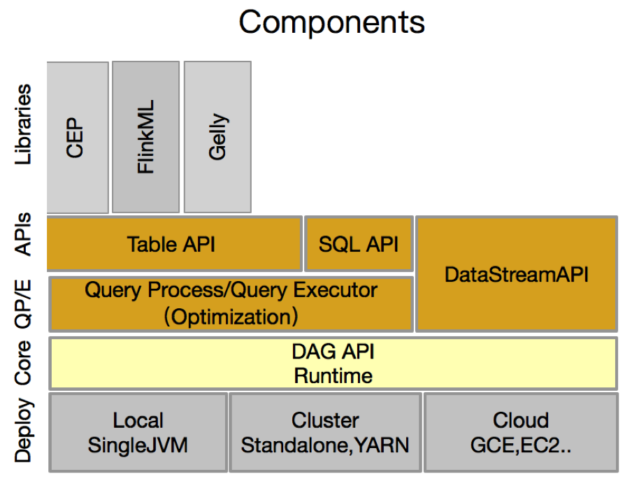

相对于DataStream而言SQL会经过Optimization模块透明的为用户进行查询优化，用户专心编写自己的业务逻辑，不用担心性能，却能得到最优的查询性能!

## 简洁
就简洁性而言SQL与DataSet和DataStream相比具有很大的优越性，我们先一个WordCount示例来直观的查看用户的代码量：
* DataStream/DataSetAPI
```
... //省略初始化代码
// 核心逻辑
text.flatMap(new WordCount.Tokenizer()).keyBy(new int[]{0}).sum(1);

// flatmap 代码定义
public static final class Tokenizer implements FlatMapFunction<String, Tuple2<String, Integer>> {
        public Tokenizer() {
        }

        public void flatMap(String value, Collector<Tuple2<String, Integer>> out) {
            String[] tokens = value.toLowerCase().split("\\W+");
            String[] var4 = tokens;
            int var5 = tokens.length;

            for(int var6 = 0; var6 < var5; ++var6) {
                String token = var4[var6];
                if (token.length() > 0) {
                    out.collect(new Tuple2(token, 1));
                }
            }

        }
    }
```
* SQL
```
...//省略初始化代码
SELECT word, COUNT(word) FROM tab GROUP BY word;
```
我们直观的体会到相同的统计功能使用SQL的简洁性。

# Flink SQL Job的组成
我们做任何数据计算都离不开读取原始数据，计算逻辑和写入计算结果数据三部分，当然基于Apache Flink SQL编写的计算Job也离不开这个三部分，如下所所示：


如上所示，一个完整的Apache Flink SQL Job 由如下三部分：
* Source Operator - Soruce operator是对外部数据源的抽象, 目前Apache Flink内置了很多常用的数据源实现，比如上图提到的Kafka。

* Query Operators - 查询算子主要完成如图的Query Logic，目前支持了Union，Join，Projection,Difference, Intersection以及window等大多数传统数据库支持的操作。

* Sink Operator - Sink operator 是对外结果表的抽象，目前Apache Flink也内置了很多常用的结果表的抽象，比如上图提到的Kafka。

# Flink SQL 核心算子
目前Flink SQL支持Union，Join，Projection,Difference, Intersection以及window等大多数传统数据库支持的操作，接下来为大家分别进行简单直观的介绍。

## 环境
为了很好的体验和理解Apache Flink SQL算子我们需要先准备一下测试环境，我们选择[IDEA](https://www.jetbrains.com/idea/)，以ITCase测试方式来进行体验。IDEA 安装这里不占篇幅介绍了，相信大家能轻松搞定！我们进行功能体验有两种方式，具体如下：
### 源码方式
对于开源爱好者可能更喜欢源代码方式理解和体验Apache Flink SQL功能，那么我们需要下载源代码并导入到IDEA中：
* 下载源码：
```
// 下载源代码
git clone https://github.com/apache/flink.git study
// 进入源码目录
cd study
// 拉取稳定版release-1.6
git fetch origin release-1.6:release-1.6
//切换到稳定版
git checkout release-1.6
//将依赖安装到本地mvn仓库，耐心等待需要一段时间
mvn clean install -DskipTests
```
* 导入到IDEA
将Flink源码导入到IDEA过程这里不再占用篇幅，导入后确保在IDEA中可以运行 `org.apache.flink.table.runtime.stream.sql.SqlITCase` 并测试全部通过，即证明体验环境已经完成。如下图所示：

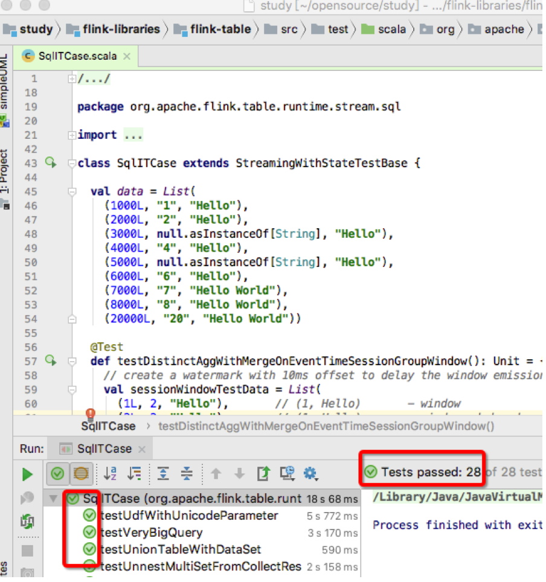

如上图运行测试后显示测试通过，我们就可以继续下面的Apache Flink SQL功能体验了。

### 依赖Flink包方式
我们还有一种更简单直接的方式，就是新建一个mvn项目，并在pom中添加如下依赖：
```
 <properties>
    <table.version>1.6-SNAPSHOT</table.version>
  </properties>

  <dependencies>
    <dependency>
      <groupId>org.apache.flink</groupId>
      <artifactId>flink-table_2.11</artifactId>
      <version>${table.version}</version>
    </dependency>

    <dependency>
      <groupId>org.apache.flink</groupId>
      <artifactId>flink-scala_2.11</artifactId>
      <version>${table.version}</version>
    </dependency>

    <dependency>
      <groupId>org.apache.flink</groupId>
      <artifactId>flink-streaming-scala_2.11</artifactId>
      <version>${table.version}</version>
    </dependency>

    <dependency>
      <groupId>org.apache.flink</groupId>
      <artifactId>flink-streaming-java_2.11</artifactId>
      <version>${table.version}</version>
    </dependency>

    <dependency>
      <groupId>JUnit</groupId>
      <artifactId>JUnit</artifactId>
      <version>4.12</version>
    </dependency>

  </dependencies>
```

完成环境准备后，我们开始准备测试数据和写一个简单的测试类。

## 示例数据及测试类
### 测试数据

* customer_tab 表 - 客户表保存客户id，客户姓名和客户描述信息。字段及测试数据如下：

| c_id |  c_name|c_desc  |
| --- | --- | --- |
| c_001 | Kevin | from JinLin |
| c_002| Sunny | from JinLin |
| c_003| JinCheng | from HeBei |

* order_tab 表 - 订单表保存客户购买的订单信息，包括订单id，订单时间和订单描述信息。 字段节测试数据如下：

| o_id | c_id | o_time|o_desc |
| --- | --- | --- | --- |
| o_oo1 | c_002 | 2018-11-05 10:01:01|iphone |
| o_002 |  c_001| 2018-11-05 10:01:55 |ipad|
| o_003| c_001 | 2018-11-05 10:03:44  | flink book|

* Item_tab 
  商品表, 携带商品id，商品类型，出售时间，价格等信息，具体数如下：
  
| itemID | itemType | onSellTime | price |
| :--- | :--- | :--- | :--- |
| ITEM001 | Electronic | 2017-11-11 10:01:00 | 20 |
| ITEM002 | Electronic | 2017-11-11 10:02:00 | 50 |
| ITEM003 | Electronic | _**2017-11-11 10:03:00**_ | 30 |
| ITEM004 | Electronic | _**2017-11-11 10:03:00**_ | 60 |
| ITEM005 | Electronic | 2017-11-11 10:05:00 | 40 |
| ITEM006 | Electronic | 2017-11-11 10:06:00 | 20 |
| ITEM007 | Electronic | 2017-11-11 10:07:00 | 70 |
| ITEM008 | Clothes | 2017-11-11 10:08:00 | 20 |

* PageAccess_tab
页面访问表，包含用户ID，访问时间，用户所在地域信息，具体数据如下：

| region | userId | accessTime |
| --- | --- | --- |
| ShangHai | U0010 | 2017-11-11 10:01:00 |
| BeiJing |  U1001| 2017-11-11 10:01:00 |
| BeiJing | U2032 | 2017-11-11 10:10:00 |
| BeiJing  | U1100 | 2017-11-11 10:11:00 |
| ShangHai | U0011 | 2017-11-11 12:10:00 |

* PageAccessCount_tab
页面访问表，访问量，访问时间，用户所在地域信息，具体数据如下：

| region | userCount | accessTime |
| --- | --- | --- |
| ShangHai | 100 | 2017.11.11 10:01:00 |
| BeiJing |  86| 2017.11.11 10:01:00 |
| BeiJing | 210 | 2017.11.11 10:06:00 |
| BeiJing  | 33 | 2017.11.11 10:10:00 |
| ShangHai | 129 | 2017.11.11 12:10:00 |

* PageAccessSession_tab
页面访问表，访问量，访问时间，用户所在地域信息，具体数据如下：

| region | userId | accessTime |
| --- | --- | --- |
|ShangHai|U0011|2017-11-11 10:01:00
|ShangHai|U0012|2017-11-11 10:02:00
|ShangHai|U0013|2017-11-11 10:03:00
|ShangHai|U0015|2017-11-11 10:05:00
|ShangHai|U0011|2017-11-11 10:10:00
|BeiJing|U0110|2017-11-11 10:10:00
|ShangHai|U2010|2017-11-11 10:11:00
|ShangHai|U0410|2017-11-11 12:16:00

### 测试类
我们创建一个`SqlOverviewITCase.scala` 用于接下来介绍Flink SQL算子的功能体验。代码如下：
```
import org.apache.flink.api.scala._
import org.apache.flink.runtime.state.StateBackend
import org.apache.flink.runtime.state.memory.MemoryStateBackend
import org.apache.flink.streaming.api.TimeCharacteristic
import org.apache.flink.streaming.api.functions.sink.RichSinkFunction
import org.apache.flink.streaming.api.functions.source.SourceFunction
import org.apache.flink.streaming.api.functions.source.SourceFunction.SourceContext
import org.apache.flink.streaming.api.scala.StreamExecutionEnvironment
import org.apache.flink.streaming.api.watermark.Watermark
import org.apache.flink.table.api.TableEnvironment
import org.apache.flink.table.api.scala._
import org.apache.flink.types.Row
import org.junit.rules.TemporaryFolder
import org.junit.{Rule, Test}

import scala.collection.mutable
import scala.collection.mutable.ArrayBuffer

class SqlOverviewITCase {
  val _tempFolder = new TemporaryFolder

  @Rule
  def tempFolder: TemporaryFolder = _tempFolder

  def getStateBackend: StateBackend = {
    new MemoryStateBackend()
  }

  // 客户表数据
  val customer_data = new mutable.MutableList[(String, String, String)]
  customer_data.+=(("c_001", "Kevin", "from JinLin"))
  customer_data.+=(("c_002", "Sunny", "from JinLin"))
  customer_data.+=(("c_003", "JinCheng", "from HeBei"))


  // 订单表数据
  val order_data = new mutable.MutableList[(String, String, String, String)]
  order_data.+=(("o_001", "c_002", "2018-11-05 10:01:01", "iphone"))
  order_data.+=(("o_002", "c_001", "2018-11-05 10:01:55", "ipad"))
  order_data.+=(("o_003", "c_001", "2018-11-05 10:03:44", "flink book"))

  // 商品销售表数据
  val item_data = Seq(
    Left((1510365660000L, (1510365660000L, 20, "ITEM001", "Electronic"))),
    Right((1510365660000L)),
    Left((1510365720000L, (1510365720000L, 50, "ITEM002", "Electronic"))),
    Right((1510365720000L)),
    Left((1510365780000L, (1510365780000L, 30, "ITEM003", "Electronic"))),
    Left((1510365780000L, (1510365780000L, 60, "ITEM004", "Electronic"))),
    Right((1510365780000L)),
    Left((1510365900000L, (1510365900000L, 40, "ITEM005", "Electronic"))),
    Right((1510365900000L)),
    Left((1510365960000L, (1510365960000L, 20, "ITEM006", "Electronic"))),
    Right((1510365960000L)),
    Left((1510366020000L, (1510366020000L, 70, "ITEM007", "Electronic"))),
    Right((1510366020000L)),
    Left((1510366080000L, (1510366080000L, 20, "ITEM008", "Clothes"))),
    Right((151036608000L)))

  // 页面访问表数据
  val pageAccess_data = Seq(
    Left((1510365660000L, (1510365660000L, "ShangHai", "U0010"))),
    Right((1510365660000L)),
    Left((1510365660000L, (1510365660000L, "BeiJing", "U1001"))),
    Right((1510365660000L)),
    Left((1510366200000L, (1510366200000L, "BeiJing", "U2032"))),
    Right((1510366200000L)),
    Left((1510366260000L, (1510366260000L, "BeiJing", "U1100"))),
    Right((1510366260000L)),
    Left((1510373400000L, (1510373400000L, "ShangHai", "U0011"))),
    Right((1510373400000L)))

  // 页面访问量表数据2
  val pageAccessCount_data = Seq(
    Left((1510365660000L, (1510365660000L, "ShangHai", 100))),
    Right((1510365660000L)),
    Left((1510365660000L, (1510365660000L, "BeiJing", 86))),
    Right((1510365660000L)),
    Left((1510365960000L, (1510365960000L, "BeiJing", 210))),
    Right((1510366200000L)),
    Left((1510366200000L, (1510366200000L, "BeiJing", 33))),
    Right((1510366200000L)),
    Left((1510373400000L, (1510373400000L, "ShangHai", 129))),
    Right((1510373400000L)))

  // 页面访问表数据3
  val pageAccessSession_data = Seq(
    Left((1510365660000L, (1510365660000L, "ShangHai", "U0011"))),
    Right((1510365660000L)),
    Left((1510365720000L, (1510365720000L, "ShangHai", "U0012"))),
    Right((1510365720000L)),
    Left((1510365720000L, (1510365720000L, "ShangHai", "U0013"))),
    Right((1510365720000L)),
    Left((1510365900000L, (1510365900000L, "ShangHai", "U0015"))),
    Right((1510365900000L)),
    Left((1510366200000L, (1510366200000L, "ShangHai", "U0011"))),
    Right((1510366200000L)),
    Left((1510366200000L, (1510366200000L, "BeiJing", "U2010"))),
    Right((1510366200000L)),
    Left((1510366260000L, (1510366260000L, "ShangHai", "U0011"))),
    Right((1510366260000L)),
    Left((1510373760000L, (1510373760000L, "ShangHai", "U0410"))),
    Right((1510373760000L)))

  def procTimePrint(sql: String): Unit = {
    // Streaming 环境
    val env = StreamExecutionEnvironment.getExecutionEnvironment
    val tEnv = TableEnvironment.getTableEnvironment(env)

    // 将order_tab, customer_tab 注册到catalog
    val customer = env.fromCollection(customer_data).toTable(tEnv).as('c_id, 'c_name, 'c_desc)
    val order = env.fromCollection(order_data).toTable(tEnv).as('o_id, 'c_id, 'o_time, 'o_desc)

    tEnv.registerTable("order_tab", order)
    tEnv.registerTable("customer_tab", customer)

    val result = tEnv.sqlQuery(sql).toRetractStream[Row]
    val sink = new RetractingSink
    result.addSink(sink)
    env.execute()
  }

  def rowTimePrint(sql: String): Unit = {
    // Streaming 环境
    val env = StreamExecutionEnvironment.getExecutionEnvironment
    env.setStreamTimeCharacteristic(TimeCharacteristic.EventTime)
    env.setStateBackend(getStateBackend)
    env.setParallelism(1)
    val tEnv = TableEnvironment.getTableEnvironment(env)

    // 将item_tab, pageAccess_tab 注册到catalog
    val item =
      env.addSource(new EventTimeSourceFunction[(Long, Int, String, String)](item_data))
      .toTable(tEnv, 'onSellTime, 'price, 'itemID, 'itemType, 'rowtime.rowtime)

    val pageAccess =
      env.addSource(new EventTimeSourceFunction[(Long, String, String)](pageAccess_data))
      .toTable(tEnv, 'accessTime, 'region, 'userId, 'rowtime.rowtime)

    val pageAccessCount =
      env.addSource(new EventTimeSourceFunction[(Long, String, Int)](pageAccessCount_data))
      .toTable(tEnv, 'accessTime, 'region, 'accessCount, 'rowtime.rowtime)

    val pageAccessSession =
      env.addSource(new EventTimeSourceFunction[(Long, String, String)](pageAccessSession_data))
      .toTable(tEnv, 'accessTime, 'region, 'userId, 'rowtime.rowtime)

    tEnv.registerTable("item_tab", item)
    tEnv.registerTable("pageAccess_tab", pageAccess)
    tEnv.registerTable("pageAccessCount_tab", pageAccessCount)
    tEnv.registerTable("pageAccessSession_tab", pageAccessSession)

    val result = tEnv.sqlQuery(sql).toRetractStream[Row]
    val sink = new RetractingSink
    result.addSink(sink)
    env.execute()

  }

  @Test
  def testSelect(): Unit = {
    val sql = "替换想要测试的SQL"
    // 非window 相关用 procTimePrint(sql)
    // Window 相关用 rowTimePrint(sql)
  }

}

// 自定义Sink
final class RetractingSink extends RichSinkFunction[(Boolean, Row)] {
  var retractedResults: ArrayBuffer[String] = mutable.ArrayBuffer.empty[String]

  def invoke(v: (Boolean, Row)) {
    retractedResults.synchronized {
      val value = v._2.toString
      if (v._1) {
        retractedResults += value
      } else {
        val idx = retractedResults.indexOf(value)
        if (idx >= 0) {
          retractedResults.remove(idx)
        } else {
          throw new RuntimeException("Tried to retract a value that wasn't added first. " +
                                       "This is probably an incorrectly implemented test. " +
                                       "Try to set the parallelism of the sink to 1.")
        }
      }
    }
    retractedResults.sorted.foreach(println(_))
  }
}

// Water mark 生成器
class EventTimeSourceFunction[T](
  dataWithTimestampList: Seq[Either[(Long, T), Long]]) extends SourceFunction[T] {
  override def run(ctx: SourceContext[T]): Unit = {
    dataWithTimestampList.foreach {
      case Left(t) => ctx.collectWithTimestamp(t._2, t._1)
      case Right(w) => ctx.emitWatermark(new Watermark(w))
    }
  }

  override def cancel(): Unit = ???
}
```

## Select
SELECT 用于从数据集/流中选择数据，语法遵循ANSI-SQL标准，语义是关系代数中的投影(Projection),对关系进行垂直分割，消去某些列, 如下图所示:

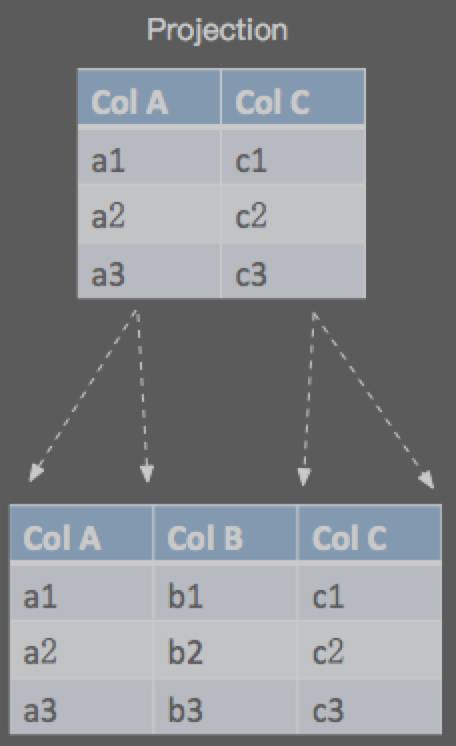

### SQL 示例
从`customer_tab`选择用户姓名，并用内置的CONCAT函数拼接客户信息，如下：
```
SELECT c_name, CONCAT(c_name, ' come ', c_desc) as desc  FROM customer_tab;
```
### Result

| c_name | desc |
| --- | --- |
| Kevin | Kevin come from JinLin |
| Sunny | Sunny come from JinLin |
| Jincheng|Jincheng come from HeBei|

### 特别说明
大家看到在 `SELECT` 不仅可以使用普通的字段选择，还可以使用`ScalarFunction`,当然也包括`User-Defined Function`，同时还可以进行字段的`alias`设置。其实`SELECT`可以结合聚合，后面GROUPBY分组部分进行介绍,一个比较特殊的使用场景是携带 `DISTINCT` 关键字，示例如下：
#### SQL 示例
在订单表查询所有的客户id，消除重复客户id, 如下：
```
SELECT DISTINCT c_id FROM order_tab;
```
#### Result

| c_id |
| --- |
| c_001 |  
| c_002 |

## WHERE
WHERE 用于从数据集/流中过滤数据，与SELECT一起使用，语法遵循ANSI-SQL标准，语义是关系代数的Selection，根据某些条件对关系做水平分割，即选择符合条件的记录，如下所示：

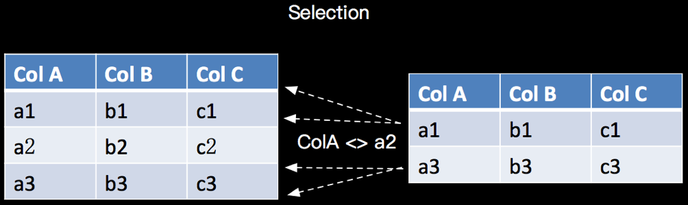

### SQL 示例
在`customer_tab`查询客户id为`c_001`和`c_003`的客户信息，如下：
```
SELECT c_id, c_name, c_desc FROM customer_tab WHERE c_id = 'c_001' OR c_id = 'c_003';
```
### Result

| c_id |  c_name|c_desc  |
| --- | --- | --- |
| c_001 | Kevin | from JinLin |
| c_003| JinCheng | from HeBei |

### 特别说明
我们发现`WHERE`是对满足一定条件的数据进行过滤，`WHERE`支持=, <, >, <>, >=, <=以及`AND`， `OR`等表达式的组合，最终满足过滤条件的数据会被选择出来。并且 `WHERE` 可以结合`IN`,`NOT IN`联合使用，具体如下：
#### SQL 示例 (IN 常量)
使用 `IN` 在`customer_tab`查询客户id为`c_001`和`c_003`的客户信息，如下：
```
SELECT c_id, c_name, c_desc FROM customer_tab WHERE c_id IN ('c_001', 'c_003');
```
#### Result
| c_id |  c_name|c_desc  |
| --- | --- | --- |
| c_001 | Kevin | from JinLin |
| c_003| JinCheng | from HeBei |

#### SQL 示例 (IN 子查询)
使用 `IN`和 子查询 在`customer_tab`查询已经下过订单的客户信息，如下：
```
SELECT c_id, c_name, c_desc FROM customer_tab WHERE c_id IN (SELECT c_id FROM order_tab);
```
#### Result
| c_id |  c_name|c_desc  |
| --- | --- | --- |
| c_001 | Kevin | from JinLin |
| c_002| Sunny | from JinLin |

#### IN/NOT IN 与关系代数
如上介绍IN是关系代数中的Intersection， NOT IN是关系代数的Difference， 如下图示意：
* IN(Intersection)
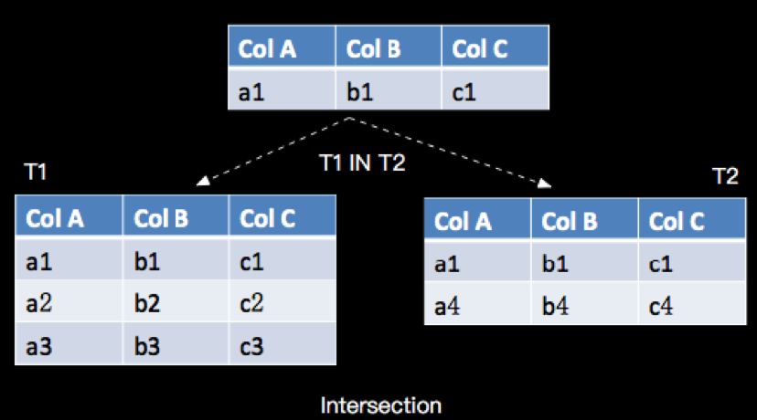

* NOT IN(Difference)

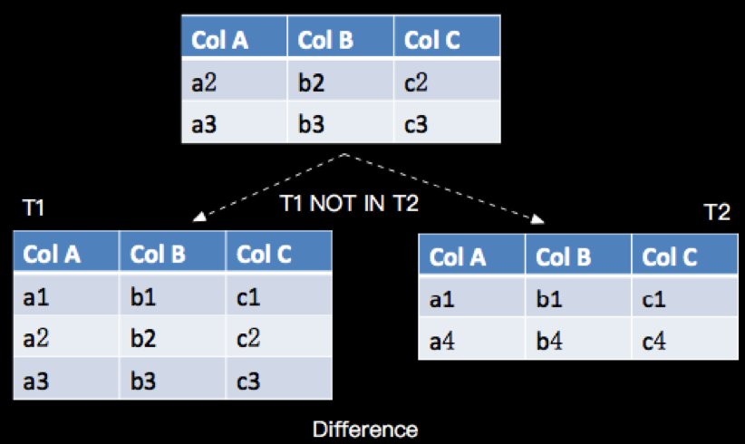

## GROUP BY
GROUP BY 是对数据进行分组的操作，比如我需要分别计算一下一个学生表里面女生和男生的人数分别是多少，如下：

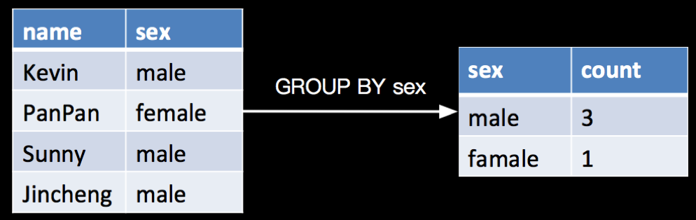

### SQL 示例
将order_tab信息按customer_tab分组统计订单数量，简单示例如下：
```
SELECT c_id, count(o_id) as o_count FROM order_tab GROUP BY c_id;
```
### Result
| c_id |o_count  |
| --- | --- |
| c_001 | 2 |
| c_002 | 1 |

### 特别说明
  在实际的业务场景中，GROUP BY除了按业务字段进行分组外，很多时候用户也可以用时间来进行分组(相当于划分窗口)，比如统计每分钟的订单数量：
  
#### SQL 示例
按时间进行分组，查询每分钟的订单数量，如下：
    ```
   SELECT SUBSTRING(o_time, 1, 16) AS o_time_min, count(o_id) AS o_count FROM order_tab GROUP BY SUBSTRING(o_time, 1, 16)
    ```
    
#### Result
    
| o_time_min | o_count |
| --- | --- |
| 2018-11-05 10:01|  2|
| 2018-11-05 10:03|  1|

说明：如果我们时间字段是timestamp类型，建议使用内置的 `DATE_FORMAT` 函数。
    
## UNION ALL
UNION ALL 将两个表合并起来，要求两个表的字段完全一致，包括字段类型、字段顺序,语义对应关系代数的Union，只是关系代数是Set集合操作，会有去重复操作，UNION ALL 不进行去重，如下所示：

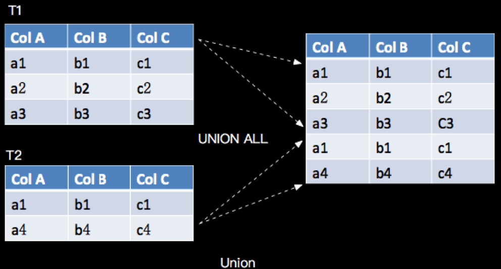

### SQL 示例
我们简单的将`customer_tab`查询2次，将查询结果合并起来，如下：
```
SELECT c_id, c_name, c_desc  FROM customer_tab 
UNION ALL 
SELECT c_id, c_name, c_desc  FROM customer_tab
```

### Result

| c_id |  c_name|c_desc  |
| --- | --- | --- |
| c_001 | Kevin | from JinLin |
| c_002| Sunny | from JinLin |
| c_003| JinCheng | from HeBei |
| c_001 | Kevin | from JinLin |
| c_002| Sunny | from JinLin |
| c_003| JinCheng | from HeBei |

### 特别说明
UNION ALL 对结果数据不进行去重，如果想对结果数据进行去重，传统数据库需要进行UNION操作。

## UNION
UNION 将两个流给合并起来，要求两个流的字段完全一致，包括字段类型、字段顺序，并其UNION 不同于UNION ALL，UNION会对结果数据去重,与关系代数的Union语义一致，如下：

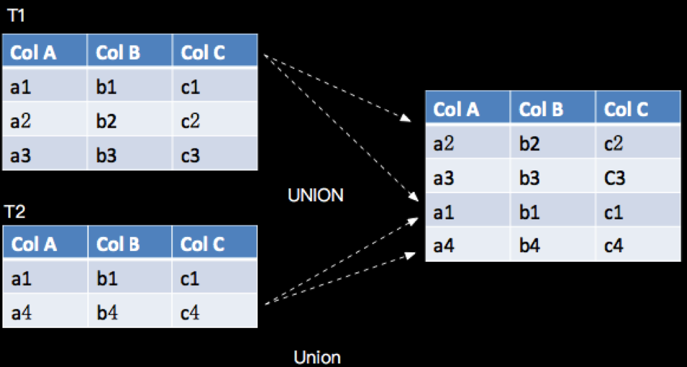

### SQL 示例
我们简单的将`customer_tab`查询2次，将查询结果合并起来，如下：
```
SELECT c_id, c_name, c_desc  FROM customer_tab 
UNION 
SELECT c_id, c_name, c_desc  FROM customer_tab
```
我们发现完全一样的表数据进行 `UNION`之后，数据是被去重的，`UNION`之后的数据并没有增加。

### Result

| c_id |  c_name|c_desc  |
| --- | --- | --- |
| c_001 | Kevin | from JinLin |
| c_002| Sunny | from JinLin |
| c_003| JinCheng | from HeBei |

### 特别说明
UNION 对结果数据进行去重，在实际的实现过程需要对数据进行排序操作，所以非必要去重情况请使用UNION ALL操作。

## JOIN 
JOIN 用于把来自两个表的行联合起来形成一个宽表，Apache Flink支持的JOIN类型：
* JOIN - INNER JOIN
* LEFT JOIN - LEFT OUTER JOIN
* RIGHT JOIN - RIGHT OUTER JOIN  
* FULL JOIN - FULL OUTER JOIN
JOIN与关系代数的Join语义相同，具体如下：

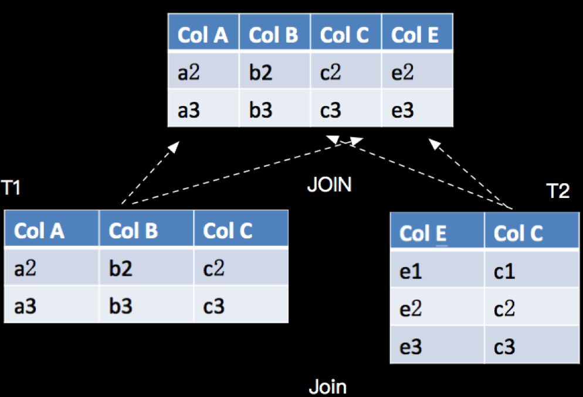

### SQL 示例 (JOIN)
`INNER JOIN`只选择满足`ON`条件的记录，我们查询`customer_tab` 和 `order_tab`表，将有订单的客户和订单信息选择出来，如下：
```
SELECT * FROM customer_tab AS c JOIN order_tab AS o ON o.c_id = c.c_id
```
### Result

| c_id |  c_name|c_desc  | o_id | c_id | o_time|o_desc |
| --- | --- | --- | --- | --- | --- | --- |
| c_001 | Kevin | from JinLin | o_002 |  c_001| 2018-11-05 10:01:55 |ipad|
| c_001 | Kevin | from JinLin | o_003| c_001 | 2018-11-05 10:03:44  | flink book|
| c_002| Sunny | from JinLin | o_oo1 | c_002 | 2018-11-05 10:01:01|iphone |

### SQL 示例 (LEFT JOIN)
`LEFT JOIN`与`INNER JOIN`的区别是当右表没有与左边相JOIN的数据时候，右边对应的字段补`NULL`输出，语义如下：

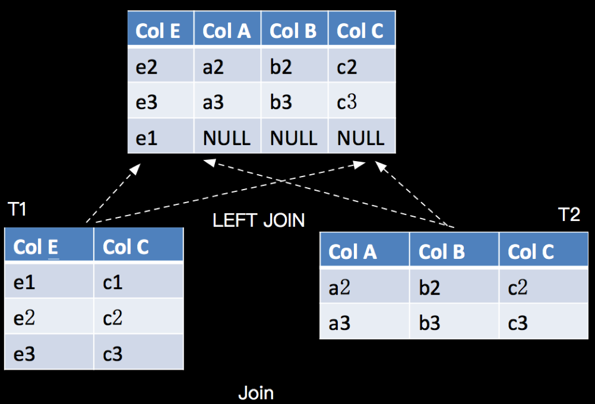

对应的SQL语句如下(LEFT JOIN)：
```
SELECT ColA, ColB, T2.ColC, ColE FROM TI LEFT JOIN T2 ON T1.ColC = T2.ColC ; 
```
* 细心的读者可能发现上面T2.ColC是添加了前缀T2了，这里需要说明一下，当两张表有字段名字一样的时候，我需要指定是从那个表里面投影的。

我们查询`customer_tab` 和 `order_tab`表，将客户和订单信息选择出来如下：
```
SELECT * FROM customer_tab AS c LEFT JOIN order_tab AS o ON o.c_id = c.c_id
```
### Result
| c_id |  c_name|c_desc  | o_id | c_id | o_time|o_desc |
| --- | --- | --- | --- | --- | --- | --- |
| c_001 | Kevin | from JinLin | o_002 |  c_001| 2018-11-05 10:01:55 |ipad|
| c_001 | Kevin | from JinLin | o_003| c_001 | 2018-11-05 10:03:44  | flink book|
| c_002| Sunny | from JinLin | o_oo1 | c_002 | 2018-11-05 10:01:01|iphone |
| c_003| JinCheng | from HeBei | NULL|NULL|NULL|NULL


### 特别说明
`RIGHT JOIN` 相当于 `LEFT JOIN` 左右两个表交互一下位置。`FULL JOIN`相当于 `RIGHT JOIN` 和 `LEFT JOIN` 之后进行`UNION ALL`操作。

## Window
在Apache Flink中有2种类型的Window，一种是OverWindow，即传统数据库的标准开窗，每一个元素都对应一个窗口。一种是GroupWindow，目前在SQL中GroupWindow都是基于时间进行窗口划分的。

### Over Window
Apache Flink中对OVER Window的定义遵循标准SQL的定义语法。
按ROWS和RANGE分类是传统数据库的标准分类方法，在Apache Flink中还可以根据时间类型(ProcTime/EventTime)和窗口的有限和无限(Bounded/UnBounded)进行分类，共计8中类型。为了避免大家对过细分类造成困扰，我们按照确定当前行的不同方式将OVER Window分成两大类进行介绍，如下:
* ROWS OVER Window - 每一行元素都视为新的计算行，即，每一行都是一个新的窗口；
* RANGE OVER Window - 具有相同时间值的所有元素行视为同一计算行，即，具有相同时间值的所有行都是同一个窗口； 

#### Bounded ROWS OVER Window
Bounded ROWS OVER Window 每一行元素都视为新的计算行，即，每一行都是一个新的窗口。
##### 语义
我们以3个元素(2 PRECEDING)的窗口为例，如下图:

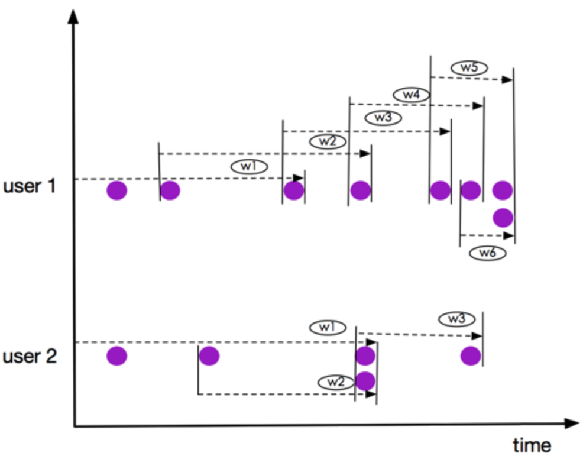

上图所示窗口 user 1 的 w5和w6， user 2的 窗口 w2 和 w3，虽然有元素都是同一时刻到达，但是他们仍然是在不同的窗口，这一点有别于RANGE OVER Window.

##### 语法
Bounded ROWS OVER Window 语法如下：
```
SELECT 
    agg1(col1) OVER(
     [PARTITION BY (value_expression1,..., value_expressionN)] 
     ORDER BY timeCol
     ROWS 
     BETWEEN (UNBOUNDED | rowCount) PRECEDING AND CURRENT ROW) AS colName, 
... 
FROM Tab1
```
* value_expression - 进行分区的字表达式；
* timeCol - 用于元素排序的时间字段；
* rowCount - 是定义根据当前行开始向前追溯几行元素；

##### SQL 示例
利用`item_tab`测试数据，我们统计同类商品中当前和当前商品之前2个商品中的最高价格。
```sql
SELECT  
    itemID,
    itemType, 
    onSellTime, 
    price,  
    MAX(price) OVER (
        PARTITION BY itemType 
        ORDER BY onSellTime 
        ROWS BETWEEN 2 preceding AND CURRENT ROW) AS maxPrice
  FROM item_tab
```
#### Result

| itemID | itemType | onSellTime | price | maxPrice |
| :--- | :--- | :--- | :--- | :--- |
| ITEM001 | Electronic | 2017-11-11 10:01:00 | 20 | 20 |
| ITEM002 | Electronic | 2017-11-11 10:02:00 | 50 | 50 |
| ITEM003 | Electronic | 2017-11-11 10:03:00 | 30 | 50 |
| ITEM004 | Electronic | 2017-11-11 10:03:00 | 60 | 60 |
| ITEM005 | Electronic | 2017-11-11 10:05:00 | 40 | 60 |
| ITEM006 | Electronic | 2017-11-11 10:06:00 | 20 | 60 |
| ITEM007 | Electronic | 2017-11-11 10:07:00 | 70 | 70 |
| ITEM008 | Clothes | 2017-11-11 10:08:00 | 20 | 20 |

#### Bounded RANGE OVER Window
Bounded RANGE OVER Window 具有相同时间值的所有元素行视为同一计算行，即，具有相同时间值的所有行都是同一个窗口；
##### 语义
我们以3秒中数据(INTERVAL '2' SECOND)的窗口为例，如下图：

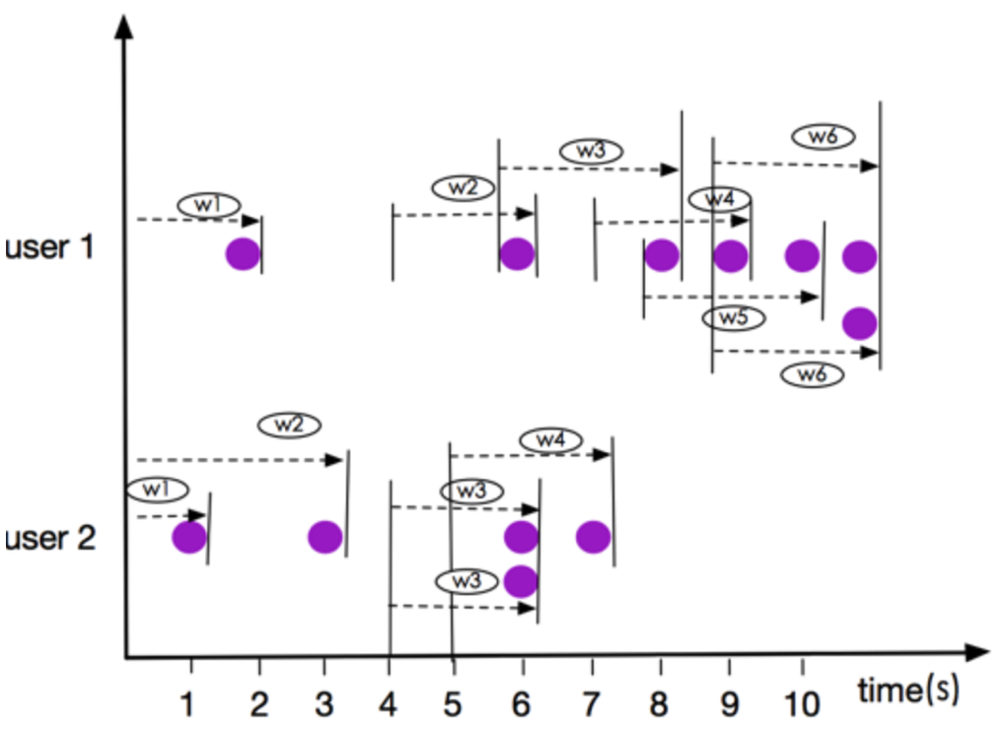

注意: 上图所示窗口 user 1 的 w6， user 2的 窗口 w3，元素都是同一时刻到达,他们是在同一个窗口，这一点有别于ROWS OVER Window.

##### 语法
Bounded RANGE OVER Window的语法如下：
```
SELECT 
    agg1(col1) OVER(
     [PARTITION BY (value_expression1,..., value_expressionN)] 
     ORDER BY timeCol
     RANGE 
     BETWEEN (UNBOUNDED | timeInterval) PRECEDING AND CURRENT ROW) AS colName, 
... 
FROM Tab1
```
* value_expression - 进行分区的字表达式；
* timeCol - 用于元素排序的时间字段；
* timeInterval - 是定义根据当前行开始向前追溯指定时间的元素行；

##### SQL 示例
我们统计同类商品中当前和当前商品之前2分钟商品中的最高价格。
```sql
SELECT  
    itemID,
    itemType, 
    onSellTime, 
    price,  
    MAX(price) OVER (
        PARTITION BY itemType 
        ORDER BY rowtime 
        RANGE BETWEEN INTERVAL '2' MINUTE preceding AND CURRENT ROW) AS maxPrice
  FROM item_tab
```
##### Result（Bounded RANGE OVER Window）
| itemID | itemType | onSellTime | price | maxPrice |
| :--- | :--- | :--- | :--- | :--- |
| ITEM001 | Electronic | 2017-11-11 10:01:00 | 20 | 20 |
| ITEM002 | Electronic | 2017-11-11 10:02:00 | 50 | 50 |
| ITEM003 | Electronic | _**2017-11-11 10:03:00**_ | 30 | 60 |
| ITEM004 | Electronic | _**2017-11-11 10:03:00**_ | 60 | 60 |
| ITEM005 | Electronic | 2017-11-11 10:05:00 | 40 | 60 |
| ITEM006 | Electronic | 2017-11-11 10:06:00 | 20 | 40 |
| ITEM007 | Electronic | 2017-11-11 10:07:00 | 70 | 70 |
| ITEM008 | Clothes | 2017-11-11 10:08:00 | 20 | 20 |

#### 特别说明
OverWindow最重要是要理解每一行数据都确定一个窗口，同时目前在Apache Flink中只支持按时间字段排序。并且OverWindow开窗与GroupBy方式数据分组最大的不同在于，GroupBy数据分组统计时候，在`SELECT`中除了GROUP BY的key，不能直接选择其他非key的字段，但是OverWindow没有这个限制，`SELECT`可以选择任何字段。比如一张表table(a,b,c,d)4个字段，如果按d分组求c的最大值，两种写完如下:
* GROUP BY - `SELECT d, MAX(c) FROM table GROUP BY d`
* OVER Window = `SELECT a, b, c, d, MAX(c) OVER(PARTITION BY d, ORDER BY ProcTime())`
如上 OVER Window 虽然PARTITION BY d,但SELECT 中仍然可以选择 a,b,c字段。但在GROUPBY中，SELECT 只能选择 d 字段。

### Group Window
根据窗口数据划分的不同，目前Apache Flink有如下3种Bounded Winodw:

* Tumble - 滚动窗口，窗口数据有固定的大小，窗口数据无叠加；
* Hop - 滑动窗口，窗口数据有固定大小，并且有固定的窗口重建频率，窗口数据有叠加；
* Session - 会话窗口，窗口数据没有固定的大小，根据窗口数据活跃程度划分窗口，窗口数据无叠加；

**说明：** Aapche Flink 还支持UnBounded的 Group Window，也就是全局Window，流上所有数据都在一个窗口里面，语义非常简单，这里不做详细介绍了。

#### Tumble
##### 语义
Tumble 滚动窗口有固定size，窗口数据不重叠,具体语义如下：

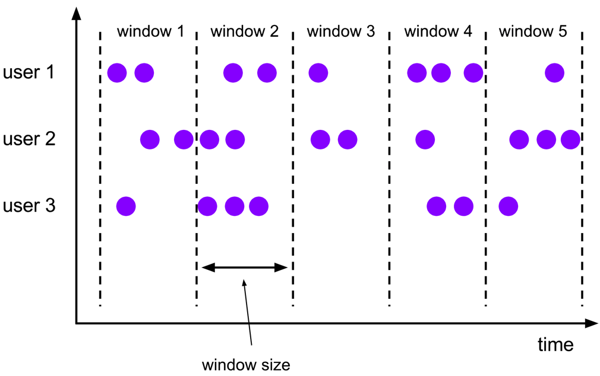

##### 语法
Tumble 滚动窗口对应的语法如下：
```
SELECT 
    [gk],
    [TUMBLE_START(timeCol, size)], 
    [TUMBLE_END(timeCol, size)], 
    agg1(col1), 
    ... 
    aggn(colN)
FROM Tab1
GROUP BY [gk], TUMBLE(timeCol, size)
```
* [gk] 决定了流是Keyed还是/Non-Keyed;
* TUMBLE_START - 窗口开始时间;
* TUMBLE_END - 窗口结束时间;
* timeCol - 是流表中表示时间字段；
* size - 表示窗口的大小，如 秒，分钟，小时，天；

##### SQL 示例
利用`pageAccess_tab`测试数据，我们需要按不同地域统计每2分钟的淘宝首页的访问量(PV).
```
SELECT  
    region,
    TUMBLE_START(rowtime, INTERVAL '2' MINUTE) AS winStart,  
    TUMBLE_END(rowtime, INTERVAL '2' MINUTE) AS winEnd,  
    COUNT(region) AS pv
FROM pageAccess_tab 
GROUP BY region, TUMBLE(rowtime, INTERVAL '2' MINUTE)
```
##### Result

| region |winStart  | winEnd | pv|
| --- | --- | --- | --- |
| BeiJing |2017-11-11 02:00:00.0|2017-11-11 02:02:00.0|1
| BeiJing | 2017-11-11 02:10:00.0|2017-11-11 02:12:00.0|2
| ShangHai |2017-11-11 02:00:00.0|2017-11-11 02:02:00.0|1
| ShangHai |2017-11-11 04:10:00.0|2017-11-11 04:12:00.0|1

#### Hop
Hop 滑动窗口和滚动窗口类似，窗口有固定的size，与滚动窗口不同的是滑动窗口可以通过slide参数控制滑动窗口的新建频率。因此当slide值小于窗口size的值的时候多个滑动窗口会重叠。
##### 语义
Hop 滑动窗口语义如所示：

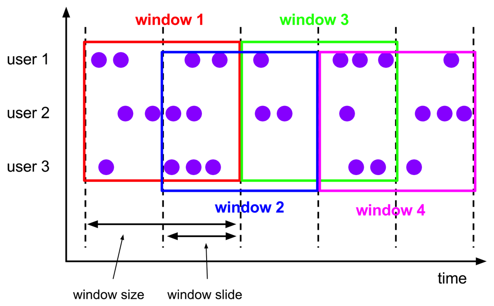

##### 语法
Hop 滑动窗口对应语法如下：
```
SELECT 
    [gk], 
    [HOP_START(timeCol, slide, size)] ,  
    [HOP_END(timeCol, slide, size)],
    agg1(col1), 
    ... 
    aggN(colN) 
FROM Tab1
GROUP BY [gk], HOP(timeCol, slide, size)
```
* [gk] 决定了流是Keyed还是/Non-Keyed;
* HOP_START - 窗口开始时间;
* HOP_END - 窗口结束时间;
* timeCol - 是流表中表示时间字段；
* slide - 是滑动步伐的大小；
* size - 是窗口的大小，如 秒，分钟，小时，天；

##### SQL 示例
利用`pageAccessCount_tab`测试数据，我们需要每5分钟统计近10分钟的页面访问量(PV).
```
SELECT  
  HOP_START(rowtime, INTERVAL '5' MINUTE, INTERVAL '10' MINUTE) AS winStart,  
  HOP_END(rowtime, INTERVAL '5' MINUTE, INTERVAL '10' MINUTE) AS winEnd,  
  SUM(accessCount) AS accessCount  
FROM pageAccessCount_tab 
GROUP BY HOP(rowtime, INTERVAL '5' MINUTE, INTERVAL '10' MINUTE)
```

##### Result

| winStart | winEnd | accessCount |
| --- | --- | --- |
|2017-11-11 01:55:00.0|2017-11-11 02:05:00.0|186
|2017-11-11 02:00:00.0|2017-11-11 02:10:00.0|396
|2017-11-11 02:05:00.0|2017-11-11 02:15:00.0|243
|2017-11-11 02:10:00.0|2017-11-11 02:20:00.0|33
|2017-11-11 04:05:00.0|2017-11-11 04:15:00.0|129
|2017-11-11 04:10:00.0|2017-11-11 04:20:00.0|129

#### Session
Seeeion 会话窗口 是没有固定大小的窗口，通过session的活跃度分组元素。不同于滚动窗口和滑动窗口，会话窗口不重叠,也没有固定的起止时间。一个会话窗口在一段时间内没有接收到元素时，即当出现非活跃间隙时关闭。一个会话窗口 分配器通过配置session gap来指定非活跃周期的时长.
##### 语义
Session 会话窗口语义如下所示：

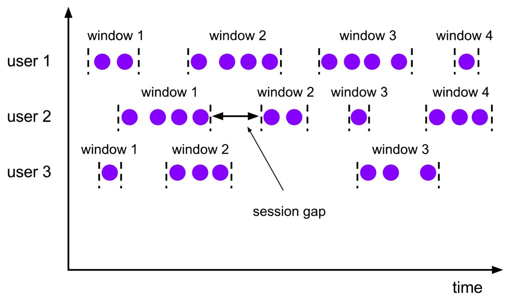

##### 语法
Seeeion 会话窗口对应语法如下：
```
SELECT 
    [gk], 
    SESSION_START(timeCol, gap) AS winStart,  
    SESSION_END(timeCol, gap) AS winEnd,
    agg1(col1),
     ... 
    aggn(colN)
FROM Tab1
GROUP BY [gk], SESSION(timeCol, gap)
```
* [gk] 决定了流是Keyed还是/Non-Keyed;
* SESSION_START - 窗口开始时间；
* SESSION_END - 窗口结束时间；
* timeCol - 是流表中表示时间字段；
* gap - 是窗口数据非活跃周期的时长；
##### SQL 示例
利用`pageAccessSession_tab`测试数据，我们按地域统计连续的两个访问用户之间的访问时间间隔不超过3分钟的的页面访问量(PV).
```
SELECT  
    region, 
    SESSION_START(rowtime, INTERVAL '3' MINUTE) AS winStart,  
    SESSION_END(rowtime, INTERVAL '3' MINUTE) AS winEnd, 
    COUNT(region) AS pv  
FROM pageAccessSession_tab
GROUP BY region, SESSION(rowtime, INTERVAL '3' MINUTE)
```
##### Result
| region | winStart | winEnd | pv |
| --- | --- | --- | --- |
|BeiJing|2017-11-11 02:10:00.0|2017-11-11 02:13:00.0|1
|ShangHai|2017-11-11 02:01:00.0|2017-11-11 02:08:00.0|4
|ShangHai|2017-11-11 02:10:00.0|2017-11-11 02:14:00.0|2
|ShangHai|2017-11-11 04:16:00.0|2017-11-11 04:19:00.0|1

## UDX
Apache Flink 除了提供了大部分ANSI-SQL的核心算子，也为用户提供了自己编写业务代码的机会，那就是User-Defined Function,目前支持如下三种
User-Defined Function：
* UDF - User-Defined Scalar Function 
* UDTF - User-Defined Table Function
* UDAF - User-Defined Aggregate Funciton

UDX都是用户自定义的函数，那么Apache Flink框架为啥将自定义的函数分成三类呢？是根据什么划分的呢？Apache Flink对自定义函数进行分类的依据是根据函数语义的不同，函数的输入和输出不同来分类的，具体如下：

| UDX | INPUT | OUTPUT | INPUT:OUTPUT |
| --- | --- | --- | --- |
|  UDF|单行中的N(N>=0)列 |单行中的1列  |1:1  |
| UDTF |单行中的N(N>=0)列 |M(M>=0)行  | 1:N(N>=0) |
| UDAF |M(M>=0)行中的每行的N(N>=0)列  |单行中的1列  | M：1(M>=0)|


### UDF
* 定义
用户想自己编写一个字符串联接的UDF，我们只需要实现`ScalarFunction#eval()`方法即可，简单实现如下：
```
object MyConnect extends ScalarFunction {
  @varargs
  def eval(args: String*): String = {
    val sb = new StringBuilder
    var i = 0
    while (i < args.length) {
      if (args(i) == null) {
        return null
      }
      sb.append(args(i))
      i += 1
    }
    sb.toString
  }
}
```
* 使用
```
...
 val fun = MyConnect
 tEnv.registerFunction("myConnect", fun)
 val sql = "SELECT myConnect(a, b) as str FROM tab"
...
```
### UDTF
* 定义
用户想自己编写一个字符串切分的UDTF，我们只需要实现`TableFunction#eval()`方法即可，简单实现如下：
ScalarFunction#eval()`
```
class MySplit extends TableFunction[String] {
  def eval(str: String): Unit = {
    if (str.contains("#")){
      str.split("#").foreach(collect)
    }
  }

  def eval(str: String, prefix: String): Unit = {
    if (str.contains("#")) {
      str.split("#").foreach(s => collect(prefix + s))
    }
  }
}
```
* 使用
```
...
val fun = new MySplit()
tEnv.registerFunction("mySplit", fun)
val sql = "SELECT c, s FROM MyTable, LATERAL TABLE(mySplit(c)) AS T(s)"
...
```

### UDAF
* 定义
UDAF 要实现的接口比较多，我们以一个简单的CountAGG为例，做简单实现如下：
```
/** The initial accumulator for count aggregate function */
class CountAccumulator extends JTuple1[Long] {
  f0 = 0L //count
}

/**
  * User-defined count aggregate function
  */
class MyCount
  extends AggregateFunction[JLong, CountAccumulator] {

  // process argument is optimized by Calcite.
  // For instance count(42) or count(*) will be optimized to count().
  def accumulate(acc: CountAccumulator): Unit = {
    acc.f0 += 1L
  }

  // process argument is optimized by Calcite.
  // For instance count(42) or count(*) will be optimized to count().
  def retract(acc: CountAccumulator): Unit = {
    acc.f0 -= 1L
  }

  def accumulate(acc: CountAccumulator, value: Any): Unit = {
    if (value != null) {
      acc.f0 += 1L
    }
  }

  def retract(acc: CountAccumulator, value: Any): Unit = {
    if (value != null) {
      acc.f0 -= 1L
    }
  }

  override def getValue(acc: CountAccumulator): JLong = {
    acc.f0
  }

  def merge(acc: CountAccumulator, its: JIterable[CountAccumulator]): Unit = {
    val iter = its.iterator()
    while (iter.hasNext) {
      acc.f0 += iter.next().f0
    }
  }

  override def createAccumulator(): CountAccumulator = {
    new CountAccumulator
  }

  def resetAccumulator(acc: CountAccumulator): Unit = {
    acc.f0 = 0L
  }

  override def getAccumulatorType: TypeInformation[CountAccumulator] = {
    new TupleTypeInfo(classOf[CountAccumulator], BasicTypeInfo.LONG_TYPE_INFO)
  }

  override def getResultType: TypeInformation[JLong] =
    BasicTypeInfo.LONG_TYPE_INFO
}
```
* 使用
```
...
val fun = new MyCount()
tEnv.registerFunction("myCount", fun)
val sql = "SELECT myCount(c) FROM MyTable GROUP BY  a"
...
```

# Source&Sink
上面我们介绍了Apache Flink SQL核心算子的语法及语义，这部分将选取Bounded EventTime Tumble Window为例为大家编写一个完整的包括Source和Sink定义的Apache Flink SQL Job。假设有一张淘宝页面访问表(PageAccess_tab)，有地域，用户ID和访问时间。我们需要按不同地域统计每2分钟的淘宝首页的访问量(PV). 具体数据如下：

| region | userId | accessTime |
| --- | --- | --- |
| ShangHai | U0010 | 2017-11-11 10:01:00 |
| BeiJing |  U1001| 2017-11-11 10:01:00 |
| BeiJing | U2032 | 2017-11-11 10:10:00 |
| BeiJing  | U1100 | 2017-11-11 10:11:00 |
| ShangHai | U0011 | 2017-11-11 12:10:00 |

## Source 定义
自定义Apache Flink Stream Source需要实现`StreamTableSource`, `StreamTableSource`中通过`StreamExecutionEnvironment` 的`addSource`方法获取`DataStream`, 所以我们需要自定义一个 `SourceFunction`, 并且要支持产生WaterMark，也就是要实现`DefinedRowtimeAttributes`接口。

### Source Function定义
支持接收携带EventTime的数据集合，Either的数据结构，Right表示WaterMark和Left表示数据:
```
class MySourceFunction[T](dataWithTimestampList: Seq[Either[(Long, T), Long]]) 
  extends SourceFunction[T] {
  override def run(ctx: SourceContext[T]): Unit = {
    dataWithTimestampList.foreach {
      case Left(t) => ctx.collectWithTimestamp(t._2, t._1)
      case Right(w) => ctx.emitWatermark(new Watermark(w))
    }
  }
  override def cancel(): Unit = ???
}
```

### 定义 StreamTableSource
我们自定义的Source要携带我们测试的数据，已经对应WaterMark数据，具体如下:
```
class MyTableSource extends StreamTableSource[Row] with DefinedRowtimeAttributes {

  val fieldNames = Array("accessTime", "region", "userId")
  val schema = new TableSchema(fieldNames, Array(Types.SQL_TIMESTAMP, Types.STRING, Types.STRING))
  val rowType = new RowTypeInfo(
    Array(Types.LONG, Types.STRING, Types.STRING).asInstanceOf[Array[TypeInformation[_]]],
    fieldNames)

  // 页面访问表数据 rows with timestamps and watermarks
  val data = Seq(
    Left(1510365660000L, Row.of(new JLong(1510365660000L), "ShangHai", "U0010")),
    Right(1510365660000L),
    Left(1510365660000L, Row.of(new JLong(1510365660000L), "BeiJing", "U1001")),
    Right(1510365660000L),
    Left(1510366200000L, Row.of(new JLong(1510366200000L), "BeiJing", "U2032")),
    Right(1510366200000L),
    Left(1510366260000L, Row.of(new JLong(1510366260000L), "BeiJing", "U1100")),
    Right(1510366260000L),
    Left(1510373400000L, Row.of(new JLong(1510373400000L), "ShangHai", "U0011")),
    Right(1510373400000L)
  )

  override def getRowtimeAttributeDescriptors: util.List[RowtimeAttributeDescriptor] = {
    Collections.singletonList(new RowtimeAttributeDescriptor(
      "accessTime",
      new ExistingField("accessTime"),
      PreserveWatermarks.INSTANCE))
  }

  override def getDataStream(execEnv: StreamExecutionEnvironment): DataStream[Row] = {
    execEnv.addSource(new MySourceFunction[Row](data)).setParallelism(1).returns(rowType)
  }

  override def getReturnType: TypeInformation[Row] = rowType

  override def getTableSchema: TableSchema = schema

}
  ```
  
## Sink 定义
我们简单的将计算结果写入到Apache Flink内置支持的CSVSink中，定义Sink如下：
```
def getCsvTableSink: TableSink[Row] = {
    val tempFile = File.createTempFile("csv_sink_", "tem")
    // 打印sink的文件路径，方便我们查看运行结果
    println("Sink path : " + tempFile)
    if (tempFile.exists()) {
      tempFile.delete()
    }
    new CsvTableSink(tempFile.getAbsolutePath).configure(
      Array[String]("region", "winStart", "winEnd", "pv"),
      Array[TypeInformation[_]](Types.STRING, Types.SQL_TIMESTAMP, Types.SQL_TIMESTAMP, Types.LONG))
  }
```

## 构建主程序
主程序包括执行环境的定义，Source/Sink的注册以及统计查SQL的执行，具体如下：
```
def main(args: Array[String]): Unit = {
    // Streaming 环境
    val env = StreamExecutionEnvironment.getExecutionEnvironment
    val tEnv = TableEnvironment.getTableEnvironment(env)

    // 设置EventTime
    env.setStreamTimeCharacteristic(TimeCharacteristic.EventTime)

    //方便我们查出输出数据
    env.setParallelism(1)

    val sourceTableName = "mySource"
    // 创建自定义source数据结构
    val tableSource = new MyTableSource

    val sinkTableName = "csvSink"
    // 创建CSV sink 数据结构
    val tableSink = getCsvTableSink

    // 注册source
    tEnv.registerTableSource(sourceTableName, tableSource)
    // 注册sink
    tEnv.registerTableSink(sinkTableName, tableSink)

    val sql =
      "SELECT  " +
      "  region, " +
      "  TUMBLE_START(accessTime, INTERVAL '2' MINUTE) AS winStart," +
      "  TUMBLE_END(accessTime, INTERVAL '2' MINUTE) AS winEnd, COUNT(region) AS pv " +
      " FROM mySource " +
      " GROUP BY TUMBLE(accessTime, INTERVAL '2' MINUTE), region"

    tEnv.sqlQuery(sql).insertInto(sinkTableName);
    env.execute()
  }
```

## 执行并查看运行结果
执行主程序后我们会在控制台得到Sink的文件路径，如下：
```
Sink path : /var/folders/88/8n406qmx2z73qvrzc_rbtv_r0000gn/T/csv_sink_8025014910735142911tem
```
Cat 方式查看计算结果，如下：
```
jinchengsunjcdeMacBook-Pro:FlinkTableApiDemo jincheng.sunjc$ cat /var/folders/88/8n406qmx2z73qvrzc_rbtv_r0000gn/T/csv_sink_8025014910735142911tem
ShangHai,2017-11-11 02:00:00.0,2017-11-11 02:02:00.0,1
BeiJing,2017-11-11 02:00:00.0,2017-11-11 02:02:00.0,1
BeiJing,2017-11-11 02:10:00.0,2017-11-11 02:12:00.0,2
ShangHai,2017-11-11 04:10:00.0,2017-11-11 04:12:00.0,1
```
表格化如上结果：
| region |winStart  | winEnd | pv|
| --- | --- | --- | --- |
| BeiJing |2017-11-11 02:00:00.0|2017-11-11 02:02:00.0|1
| BeiJing | 2017-11-11 02:10:00.0|2017-11-11 02:12:00.0|2
| ShangHai |2017-11-11 02:00:00.0|2017-11-11 02:02:00.0|1
| ShangHai |2017-11-11 04:10:00.0|2017-11-11 04:12:00.0|1

上面这个端到端的完整示例也可以应用到本篇前面介绍的其他算子示例中，只是大家根据Source和Sink的Schema不同来进行相应的构建即可！

# 总结
本篇概要的向大家介绍了SQL的由来，Apache Flink SQL 大部分核心功能，并附带了具体的测试数据和测试程序，最后以一个End-to-End的示例展示了如何编写Apache Flink SQL的Job收尾。本篇着重向大家介绍Apache Flink SQL的使用，后续我们再继续探究每个算子的实现原理。

# 附录
* [1] [Early History of SQL](https://ieeexplore.ieee.org/stamp/stamp.jsp?tp=&arnumber=6359709)
* [2] [SEQUEL: A Structured English Query Language](http://www.almaden.ibm.com/cs/people/chamberlin/sequel-1974.pdf)
* [3] [Source Code - EventTimeTumbleWindowDemo.scala](https://github.com/sunjincheng121/flink-study/blob/test/src/main/scala/org/apache/flink/study/sql/EventTimeTumbleWindowDemo.scala)